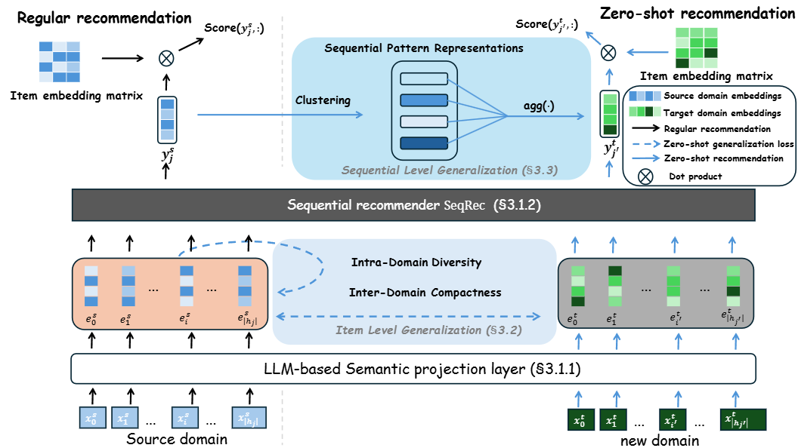

# LLM-RecG

---
Implementation for paper [`LLM-RecG: A Semantic Bias-Aware Framework for Zero-Shot Sequential Recommendation` [RecSys'25]

- This project introduces a semantic bias-aware framework for zero-shot cross-domain sequential recommendation (ZCDSR), where the goal is to make accurate recommendations in entirely new domains without additional training. While large language models (LLMs) help transfer knowledge across domains, domain semantic bias—differences in language and content between domains—often leads to misaligned item representations and weak generalization. 

- We improve cross-domain alignment at both the item and sequence levels, enabling more reliable and transferable user behavior modeling. Our method significantly boosts zero-shot performance across diverse datasets, offering a scalable and training-free solution to domain adaptation in recommendation systems.

<p align="center">
  
</p>

## Requirements

- Python==3.9.20
- torch==2.5.0
- transformers==4.40.2
- datasets==3.1.0
- evaluate==0.4.3
- llm2vec==0.2.2
- numpy==2.0.2
- pandas==2.2.3
- scikit-learn==1.5.2
- scipy==1.13.1
- tqdm==4.66.5

## Structure 📦
```
📦 RecG/
├── data/                   # preprocessed datasets
│   └── ...
├── models/                 # Model components (e.g., base model, loss functions)
│   └── ...
├── results/                # Output files, logs, evaluation results
│   └── ...
├── saved_ckpts/            # Saved model checkpoints
│   └── ...
├── cross_domain_rec.py     # Base model('-Sem') training and evaluation script
├── domain_alignment_rec.py # RecG model('-RecG') training and evaluation script
├── rec_datasets.py         # Dataset loading and processing logic
├── utils.py                # Utility functions (e.g., logging, evaluation metrics)
└── ...
```
## 📚 Usage

### 📦 Datasets

All processed dataset files can be downloaded from the following link:

🔗 [Google Drive – Processed Datasets](https://drive.google.com/drive/folders/1-cVgAZzJWcWU3bapGwdWl-lL35HFGLf-?usp=sharing)

Place the downloaded folders under the `./data/` directory.

---

### ⚡ Quick Start

To run this project, follow these two steps:

#### 1. Run the semantic embedding mapping:

```bash
  python semantic_case_study.py --dataset_name amazon_industrial_and_scientific
```

#### 2. Run the domain alignment training and evaluation

```bash
  python domain_alignment_rec.py \
  --model_name gru4rec \
  --dataset_name amazon_musical_instruments \
  --batch_size 128 \
  --learning_rate 1e-4 \
  --num_epochs 50 \
  --semantic_embedding \
  --early_stop_patience 5
```
This will train the model on the specified source domain and evaluate its generalization to other domains using zero-shot transfer.

